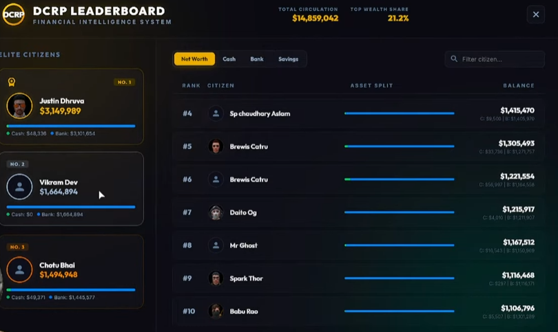

# PPR Economy Leaderboard 🏆

A modern, high-performance, and visually stunning economy leaderboard resource for FiveM. Out of the box, it highlights the top 10 wealthiest citizens of your server on a gorgeous glassmorphism-styled NUI screen, featuring a 3D-styled podium for the top 3 and detailed breakdown lists for the rest.



---

## ✨ Features

- 💎 **Premium UI Design**: Built with a sleek, interactive glassmorphism aesthetic, featuring radial glow backlights, custom SVG branding, and smooth CSS animations.
- 🥇 **Interactive Podium**: Displays the Top 3 players on a pedestal with a crown badge for first place, displaying their avatar, name, and total wealth.
- 📊 **Detailed Breakdown**: Shows granular money allocation including **Cash**, **Bank**, and **Savings** account balances.
- 🌐 **Automatic Total Circulation**: Dynamically calculates and displays the total economy circulation of the top 10 richest citizens.
- ⚙️ **Multi-Framework Support**: Seamless, built-in integrations for **QB-Core** and **ESX**.
- 🛠️ **Fully Customizable (Custom Mode)**: Use raw SQL configurations to query databases from any custom framework or table schema.
- 🖼️ **Dynamic Avatar System**:
  - **Mugshots**: Displays character mugshots (base64 or direct files) stored in the database.
  - **Steam API**: Resolves Steam Hex to decimal and retrieves full Steam profile pictures.
  - **Discord API**: Resolves Discord identifiers and retrieves active avatars via Discord CDN.
  - **Fallback System**: Automatically falls back to standard user icons or a configured default image when no avatar is found.
- ⚡ **Optimized Performance**: Caches database queries server-side with a configurable timer (default: 15 minutes) to eliminate database strain.
- 🎮 **FiveM Native Bindings**: Registers key mapping (`RegisterKeyMapping`) allowing players to customize their toggle keybind.

---

## 🚀 Installation

1. **Download & Extract**:
   Download the resource and place the folder `ppr-leaderboard` inside your FiveM server's `resources` directory.

2. **Configure Database & Framework**:
   Open [config.lua](file:///c:/Users/pratheek/Downloads/ppr-scripts/ppr/ppr-leaderboard/config.lua) and adjust settings to match your server's configuration (see configuration details below).

3. **Ensure Resource**:
   Add the following line to your `server.cfg`:
   ```cfg
   ensure ppr-leaderboard
   ```

---

## ⚙️ Configuration Guide

The script is highly customizable through [config.lua](file:///c:/Users/pratheek/Downloads/ppr-scripts/ppr/ppr-leaderboard/config.lua).

```lua
Config = {}

-- General Settings
Config.Framework = 'qb-core'       -- Options: 'qb-core', 'esx', 'custom'
Config.CommandName = 'leaderboard'  -- In-game command to open leaderboard
Config.UseKeybind = true            -- Allow players to open the UI via a keybind
Config.Keybind = 'F9'               -- Default keybind (Users can rebind in FiveM settings)
Config.UiTitle = 'PPR LEADERBOARD'  -- Title displayed in NUI Header
Config.CacheTimer = 15              -- Leaderboard cache lifetime in minutes

-- Savings Account Configuration
Config.Savings = {
    Enabled = true,
    Type = 'table',                 -- Options: 'column' (in player/users table), 'table' (separate table)
    ColumnName = 'savings',         -- Column name if Type is 'column'
    TableName = 'bank_accounts',    -- Table name if Type is 'table'
    ValueColumn = 'amount',         -- Column representing savings balance
    OwnerColumn = 'citizenid',      -- Column linking savings to identifier
    QueryFilter = "type = 'savings'"-- Custom SQL filter to select savings accounts
}

-- Avatar Settings
Config.AvatarSource = 'mugshot'     -- Options: 'mugshot', 'steam', 'discord', 'default'
Config.MugshotColumn = 'mugshot'    -- Database column name where mugshot is stored
Config.SteamAPIKey = ''             -- Required for Steam avatar resolution
Config.DiscordBotToken = ''         -- Required for Discord avatar resolution (Bot token)
Config.DefaultAvatar = ''           -- URL to use if no avatar can be retrieved
```

### 🧩 Custom Query Mode
If your server uses a custom framework or schema, set `Config.Framework = 'custom'` and configure your SQL query inside `Config.CustomQueries.GetTopPlayers`. 

The query must return the following columns:
* `identifier` (e.g. Character Identifier)
* `name` (e.g. Display Name)
* `cash` (e.g. Cash Balance)
* `bank` (e.g. Bank Balance)
* `savings` (e.g. Savings Balance - defaults to 0 if not present)
* `avatar` (e.g. Image URL or Base64 String)

---

## 🎮 Commands & Keybinds

| Command | Description | Permissions |
| :--- | :--- | :--- |
| `/leaderboard` | Toggles the economy leaderboard screen | All Players |
| `/refreshleaderboard` | Force-refreshes the leaderboard server cache | Admin / Console |

*Players can press **`ESC`** or click the **`Close (X)`** button at the top right to close the screen.*

---

## 🛠️ Credits & Support
Developed by **PPR DEVELOPMENT**. 

For questions, issues, or suggestions, please open an issue in the repository or contact support.
